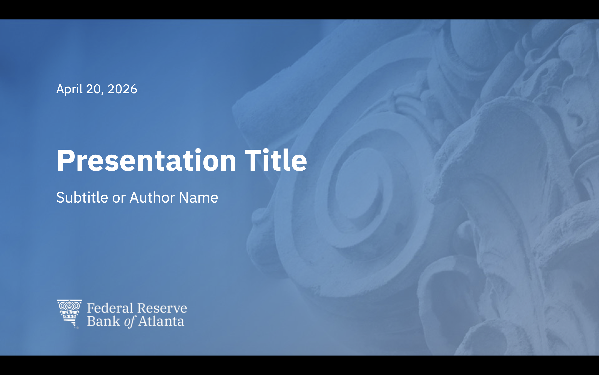
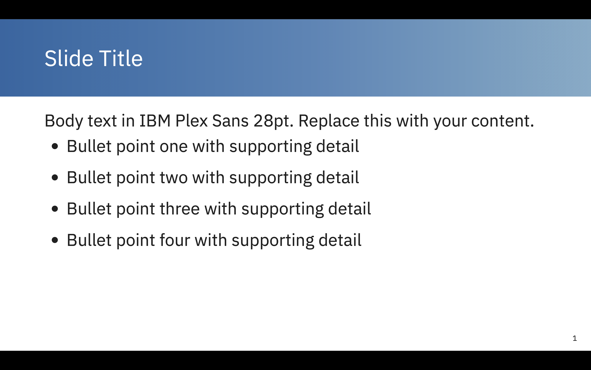

# Atlanta Fed RevealJS Quarto Theme

A [Quarto](https://quarto.org) extension providing a [RevealJS](https://revealjs.com) presentation theme that matches the Federal Reserve Bank of Atlanta's official PowerPoint template.

## Preview

| Title Slide | Content Slide |
|---|---|
|  |  |

## Installation

Install the extension into an existing Quarto project:

```bash
quarto add <your-github-username>/atlanta-fed-revealjs
```

Or use this repo as a template to start a new presentation:

```bash
quarto use template <your-github-username>/atlanta-fed-revealjs
```

> **Note:** After installing, copy `logo.png` and `title_background.jpg` into your project directory (same folder as your `.qmd` file).

## Usage

Add the following YAML front matter to your `.qmd` file:

```yaml
---
title: "Presentation Title"
subtitle: "Subtitle or Author Name"
date: "April 20, 2026"
format:
  atlanta-fed-revealjs:
    title-slide-attributes:
      data-background-image: title_background.jpg
      data-background-size: cover
      data-background-position: center
---
```

Use `##` headings to create content slides:

```markdown
## Slide Title

- Bullet point one
- Bullet point two
- Bullet point three
```

## Slide Types

### Title Slide
Set via YAML front matter. Requires `title_background.jpg` and `logo.png` in your project directory.

### Content Slide (`##`)
Blue gradient header bar with white heading, white body, slide number bottom-right.

### Two-Column Layout
Use Quarto's built-in `.columns` div:

```markdown
## Slide Title

:::  {.columns}
::: {.column}
Left column content
:::
::: {.column}
Right column content
:::
:::
```

### Tables
Standard Markdown tables are styled automatically.

## Design Specifications

| Element | Font | Size | Color | Position |
|---|---|---|---|---|
| Date (title slide) | IBM Plex Sans | 20pt | White | 1.25" × 1.35" |
| Title (title slide) | IBM Plex Sans Bold | 48pt | White | 1.25" × 2.75" |
| Subtitle (title slide) | IBM Plex Sans | 24pt | White | 1.25" × 3.75" |
| Logo (title slide) | — | 64px tall | — | 1.25" × 6.25" |
| Heading (content slides) | IBM Plex Sans | 36pt | White | 1" from left, centered in 1.75" bar |
| Body text | IBM Plex Sans | 28pt | Black | 1" × 2" |
| Slide number | IBM Plex Sans | 12pt | Black | Bottom-right |

- **Slide canvas:** 1280 × 720px (16:9)
- **Header bar:** Blue gradient (`#1065A2` → `#7AACC8`), 1.75" tall
- **Font:** [IBM Plex Sans](https://fonts.google.com/specimen/IBM+Plex+Sans) (loaded from Google Fonts)

## Required Assets

These files must be in the same directory as your `.qmd` file:

| File | Description |
|---|---|
| `logo.png` | Federal Reserve Bank of Atlanta logo (white version) |
| `title_background.jpg` | Blue architectural background for the title slide |

## Rendering

```bash
quarto render your-presentation.qmd
```

To export as PDF (one slide per page):

```bash
quarto render your-presentation.qmd --to pdf
```

## License

Internal use — Federal Reserve Bank of Atlanta.
